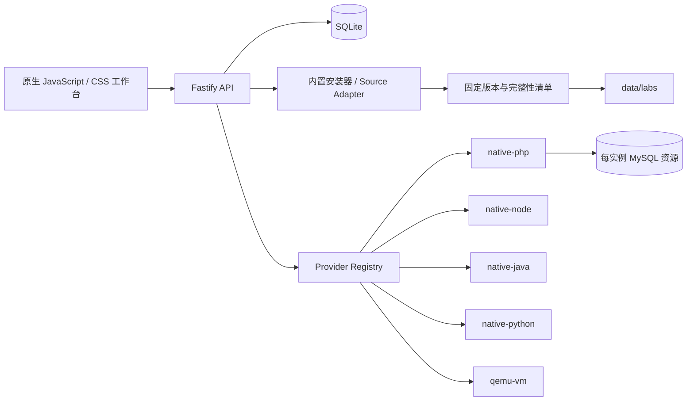

<!-- markdownlint-disable MD013 MD033 MD041 -->

<div align="center">
  
  <h1>VulnLab</h1>
  <p><strong>把主流开源靶场装进一个真正可启动的单机工作台。</strong></p>
  <p>官方资源固定版本 · 自动安装 · 原生进程运行 · 生命周期管理 · 单服务器部署</p>

  [](https://github.com/Chengxiaoyu1119/CTF-VulnLab/actions/workflows/vulnlab-ci.yml)
  [](https://nodejs.org/)
  [](https://www.typescriptlang.org/)
  [](https://fastify.dev/)
  [](https://sqlite.org/)
  [](LICENSE)
</div>

<p align="center">
  <a href="#项目是什么">项目是什么</a> ·
  <a href="#快速开始">快速开始</a> ·
  <a href="#内置靶场">内置靶场</a> ·
  <a href="#运行原理">运行原理</a> ·
  <a href="#测试">测试</a> ·
  <a href="#单服务器部署">部署</a>
</p>


## 项目是什么

VulnLab 是面向个人学习和小团队训练的开源靶场工作台。桌面端以固定 3×3 目录呈现九个主流靶场，用户可以直接完成安装、启动、访问和停止。

当前版本为 `0.3.0`。主服务采用 Node.js 原生运行，Windows、Linux、macOS 本地和单台 Linux 云服务器使用同一套代码。

大型上游资源不会提交进 Git 历史。仓库保存固定版本、官方地址、校验和安装逻辑；首次启动时资源自动进入 `src/VulnLab/data/labs`，该目录已被 Git 忽略。这既实现项目内统一管理，也避免仓库永久膨胀。

## 快速开始

### 1. 准备基础环境

- [Node.js 22 或更高版本](https://nodejs.org/)；npm 会随 Node.js 一起安装。
- 可选运行环境见下方“运行依赖”。缺少某项时，页面会明确显示受影响的靶场。

### 2. 启动

Windows：

```powershell
git clone https://github.com/Chengxiaoyu1119/CTF-VulnLab.git
cd CTF-VulnLab
powershell -ExecutionPolicy Bypass -File script/run_vulnlab.ps1
```

Linux / macOS：

```bash
git clone https://github.com/Chengxiaoyu1119/CTF-VulnLab.git
cd CTF-VulnLab
bash script/run_vulnlab.sh
```

打开 `http://127.0.0.1:6710/`。首次启动会按固定版本准备内置资源，所需时间取决于网络和磁盘速度。

### 3. 登录

| 角色 | 账号 | 本地开发密码 |
| --- | --- | --- |
| 管理员 | `vulnlab-admin` | `VulnLabAdmin123!` |
| 学员 | `vulnlab-learner` | `VulnLabLearner123!` |

生产部署必须设置独立密码和 Cookie secret，开发默认凭据在生产模式下失效。

## 内置靶场

| 靶场 | 固定来源 | 安装方式 | 运行方式 |
| --- | --- | --- | --- |
| DVWA | 官方 Git 仓库 commit | 自动下载与安全解包 | PHP + MySQL |
| Pikachu | 官方 Git 仓库 commit | 自动下载与安全解包 | PHP + MySQL |
| SQLi-Labs | 官方 Git 仓库 commit | 自动下载与安全解包 | PHP + MySQL |
| Upload-Labs | 官方 Git 仓库 commit | 自动下载与安全解包 | PHP |
| VulnHub Machines | 官方机器目录 | 按需加载目录与镜像 | QEMU |
| OWASP Juice Shop | 官方发行包 `20.2.0` | MD5 + SHA-256 校验后解包 | Node.js |
| OWASP WebGoat | 官方发行包 `2023.8` | 固定 SHA-256 校验后安装 | Java |
| OWASP Mutillidae II | 官方 Git 仓库 commit | 自动下载与安全解包 | PHP + MySQL |
| OWASP PyGoat | 官方 Git 仓库 commit | 自动建立独立 Python 环境 | Python / Django |

VulnHub 的机器镜像体积差异很大，因此只在用户选择具体机器后下载；其他八个项目可由首次启动自动准备。

## 运行依赖

| 依赖 | 影响范围 | VulnLab 的处理方式 |
| --- | --- | --- |
| PHP CLI | Upload-Labs | 自动检测版本 |
| PHP `mysqli` + MySQL/MariaDB | DVWA、Pikachu、SQLi-Labs、Mutillidae | 每次启动创建独立数据库和最小权限账号 |
| Node.js 22+ | Juice Shop | 从官方预构建发行包启动 |
| Java 17+ | WebGoat | 独立端口启动 WebGoat 与 WebWolf |
| Python 3.10 / 3.11 | PyGoat | 安装阶段创建项目私有虚拟环境并执行迁移 |
| QEMU | VulnHub Machines | 以临时快照启动已校验镜像 |

环境页会显示每项依赖的真实检测结果。靶场声明自己的 Provider，用户不需要理解或选择 Provider。

## 运行原理



- 后端：Node.js 22、TypeScript、Fastify。
- 数据：SQLite 单文件数据库。
- 前端：原生 JavaScript + CSS 工作区。
- 安装：固定上游版本、下载大小限制、路径检查、校验记录、失败清理。
- 运行：每个靶场声明 Provider；启动、续期、停止、过期回收采用统一生命周期。
- 隔离：原生靶场使用独立运行副本；VulnHub 使用 QEMU 临时快照。

## 项目结构

```text
CTF-VulnLab/
├─ src/VulnLab/
│  ├─ public/                 页面、样式与封面
│  ├─ builtin-assets.ts       官方发行包安装器
│  ├─ importer.ts             GitHub / GitLab 下载与安全解包
│  ├─ providers.ts            PHP / Node / Java / Python / QEMU Provider
│  ├─ runtime-prep.ts         PyGoat 私有运行环境准备
│  ├─ runtime-status.ts       本机依赖检测与靶场启动条件
│  ├─ vm-download.ts          VulnHub 镜像下载与校验
│  ├─ db.ts                   SQLite 数据层
│  └─ data/                   本地资源与状态，Git 忽略
├─ script/                    启动、单元测试、冒烟与浏览器回归
├─ operations/deploy/vulnlab/ 原生单机部署、备份与恢复
└─ .github/workflows/         持续集成
```

## 测试

```powershell
cd src/VulnLab
npm ci
npm run check
npm test
cd ../..
node script/check_vulnlab_node.mjs
```

测试覆盖固定版本导入、安全解包、官方发行包、下载校验、SQLite 生命周期、MySQL 资源、Provider 契约和按靶场依赖判断。

服务启动后执行浏览器回归：

```powershell
node script/smoke_vulnlab.mjs
node script/smoke_vulnlab_builtin_runtimes.mjs
python script/browser_check_vulnlab.py
```

运行冒烟会真实启动并停止 Upload-Labs、Juice Shop、WebGoat 和 PyGoat。浏览器回归检查桌面 3×3、移动端双列、九个固定卡片、靶场/运行/环境导航、环境依赖页、触控尺寸、横向溢出和控制台错误。

## 单服务器部署

仓库提供 Linux 原生部署入口，包括 systemd、Caddy、环境变量模板、备份和恢复脚本。完整步骤见 [原生单机部署指南](operations/deploy/vulnlab/native/README.zh-CN.md)。

云服务器需要按实际靶场开放或反向代理运行端口；仅供本机使用时保持默认 `127.0.0.1` 即可。

## 当前边界

- 当前定位是单机和可信小团队，不是多租户集群调度平台。
- PHP/MySQL 型靶场依赖本机数据库服务；环境页会显示缺失项。
- VulnHub 镜像由上游机器作者分别发布，格式、架构和启动参数仍需逐台验证。
- 原生进程提供练习副本和生命周期回收，但操作系统级隔离弱于虚拟机。

## 许可证

项目自有代码采用 [Apache License 2.0](LICENSE)。上游靶场、Logo 和界面截图分别遵循对应项目的许可证、版权与品牌要求，封面来源见 [素材说明](src/VulnLab/public/covers/README.md)。固定资源清单记录各项目许可证；SQLi-Labs 与 Upload-Labs 的当前固定版本记录为“上游未声明”。

安全问题请通过 [GitHub Private Vulnerability Reporting](SECURITY.md) 提交。
