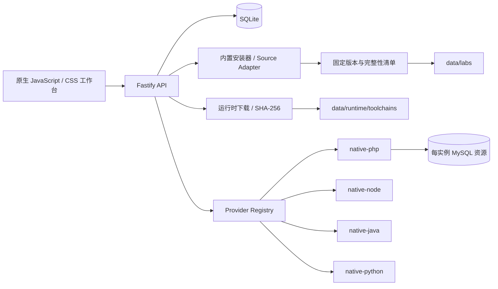

<!-- markdownlint-disable MD013 MD033 MD041 -->

<div align="center">
  
  <h1>VulnLab · 攻防控制台</h1>
  <p><strong>把主流开源安全训练环境装进一个真正可启动的单机工作台。</strong></p>
  <p>固定版本资源 · 一键启动 · 原生进程运行 · 生命周期管理 · 单服务器部署</p>

  [](https://github.com/Chengxiaoyu1119/CTF-VulnLab/actions/workflows/vulnlab-ci.yml)
  [](https://nodejs.org/)
  [](https://www.typescriptlang.org/)
  [](https://fastify.dev/)
  [](https://sqlite.org/)
  [](LICENSE)
</div>

<p align="center">
  <a href="#项目是什么">项目是什么</a> ·
  <a href="#快速开始">快速开始</a> ·
  <a href="#内置靶场">内置靶场</a> ·
  <a href="#运行原理">运行原理</a> ·
  <a href="#测试">测试</a> ·
  <a href="#单服务器部署">部署</a>
</p>


## 项目是什么

VulnLab 是面向个人学习和小团队训练的开源攻防控制台。桌面端以固定 3×3 目录呈现九个主流训练环境，用户从详情弹窗点击“启动环境”即可完成准备、启动、访问和停止。

当前代码处于开发基线，当前版本为 `0.1.0`。主服务采用 Node.js 原生运行，当前只维护 Windows x64 本地运行链路。

大型上游资源和运行时二进制不会提交进 Git 历史。仓库只保存固定版本、官方地址、可用的上游校验信息和安装逻辑；服务会记录每次下载的 SHA-256，并在上游提供固定校验值时先完成比对。靶场资源进入 `src/data/labs`，PHP/MariaDB 运行时进入 `src/data/runtime/toolchains`。整个数据目录已被 Git 忽略，既能随项目统一管理，也不会让仓库永久膨胀。

项目支持半联网和离线准备：设置 `VULNLAB_BUNDLE_DIR` 指向本地发行包目录后，启动流程按“本地 bundle → 已有 data 缓存 → 官方网络来源”选择资源；设置 `VULNLAB_OFFLINE=1` 后禁止联网，只使用本地发行包和已有缓存。发行包目录不提交到 Git。

## 快速开始

### 1. 准备基础环境

- Windows x64 首次启动对应靶场时会自动准备固定版本 Node.js 22、PHP 8.3、MariaDB 11.4、Java 21 和 Python 3.11，不需要单独安装数据库、Java 或 Python。

### 2. 启动

Windows：

```powershell
git clone https://github.com/Chengxiaoyu1119/CTF-VulnLab.git
cd CTF-VulnLab
powershell -ExecutionPolicy Bypass -File script/run_vulnlab.ps1
```

打开 `http://127.0.0.1:6710/`。点击靶场封面进入详情弹窗，再点击“启动环境”；首次启动由服务自动准备该靶场所需资源和运行时，完成后即可打开页面。服务监听地址、端口和并发参数通过部署配置或环境变量维护，不设置独立的环境页面。

### 3. 登录

本地默认管理员账号：

| 账号 | 密码 |
| --- | --- |
| `vulnlab` | `vulnlab` |

管理员登录后可从右上角账号菜单生成 24 小时有效、一次性的邀请码，也可以撤销尚未使用的邀请码。注册账号暂时统一为管理员，不增加独立用户管理页面。生产部署仍需通过 `VULNLAB_ADMIN_PASSWORD` 设置独立管理员密码，并设置 Cookie secret；生产环境不使用本地默认密码。

## 内置靶场

| 靶场 | 固定来源 | 启动前准备 | 运行方式 |
| --- | --- | --- | --- |
| DVWA | 官方 Git 仓库 commit | 页面按需下载与安全解包 | PHP + MySQL |
| Pikachu | 官方 Git 仓库 commit | 页面按需下载与安全解包 | PHP + MySQL |
| SQLi-Labs | 官方 Git 仓库 commit | 页面按需下载与安全解包 | PHP + MySQL |
| Upload-Labs | 官方 Git 仓库 commit | 页面按需下载与安全解包 | PHP |
| XVWA | 官方 Git 仓库 commit | 页面按需下载与安全解包 | PHP + MySQL |
| OWASP Juice Shop | 官方发行包 `20.2.0` | 页面按需校验后解包 | Node.js |
| OWASP WebGoat | 官方发行包 `2023.8` | 页面按需校验后安装 | Java |
| OWASP Mutillidae II | 官方 Git 仓库 commit | 页面按需下载与安全解包 | PHP + MySQL |
| OWASP PyGoat | 官方 Git 仓库 commit | 页面按需下载并建立独立 Python 环境 | Python / Django |

九个靶场的目录、版本和运行方式内置在 VulnLab 中。源码和发行包在首次启动时由服务自动下载、校验并保存到项目数据目录；也可以设置 `VULNLAB_AUTO_INSTALL_BUILTINS=1` 在服务启动时批量准备全部资源。离线包约定为 `<bundle>/runtime/<运行时文件名>`、`<bundle>/labs/<slug>/<version>/source.zip` 或内置发行包固定文件名。

## 运行依赖

| 依赖 | 影响范围 | VulnLab 的处理方式 |
| --- | --- | --- |
| PHP CLI | PHP 靶场 | Windows x64 下载官方 PHP 8.3 到 `data/runtime/toolchains` |
| PHP `mysqli`、`pdo_mysql` + MySQL/MariaDB | DVWA、Pikachu、SQLi-Labs、XVWA、Mutillidae | Windows x64 下载项目内 MariaDB 11.4；每次启动创建独立数据库和最小权限账号 |
| Node.js 22+ | VulnLab 主服务、Juice Shop | Windows x64 使用项目内 Node.js 22 |
| Java 17+ | WebGoat | Windows x64 下载项目内 Eclipse Temurin JRE 21，独立端口启动 WebGoat 与 WebWolf |
| Python 3.10 / 3.11 | PyGoat | Windows x64 下载项目内 Python 3.11，再创建项目私有虚拟环境并执行迁移 |

详情弹窗只提供“启动环境”主动作。运行依赖由服务在启动过程中自动检查和准备，失败原因通过操作提示反馈；用户不需要理解、选择或手动准备 Provider。

## 运行原理



- 后端：Node.js 22、TypeScript、Fastify。
- 数据：SQLite 单文件数据库。
- 前端：原生 JavaScript + CSS 工作区。
- 安装：固定上游版本、下载大小限制、路径检查、校验记录、失败清理。
- 运行：每个靶场声明 Provider；启动、续期、停止、过期回收采用统一生命周期。
- 隔离：原生靶场使用独立运行副本；PHP 数据库靶场使用每实例数据库和最小权限账号。

## 项目结构

```text
CTF-VulnLab/
├─ src/
│  ├─ public/                 页面、样式与封面
│  ├─ builtin-assets.ts       官方发行包安装器
│  ├─ importer.ts             GitHub / GitLab 下载与安全解包
│  ├─ providers.ts            PHP / Node / Java / Python Provider
│  ├─ runtime-prep.ts         PyGoat 私有运行环境准备
│  ├─ runtime-status.ts       本机运行依赖检测与启动前校验
│  ├─ runtime-toolchains.ts   Node.js / PHP / MariaDB / Java / Python 官方运行时下载、校验、安全解压与清单
│  ├─ project-environment.ts  项目内 PHP 配置与 MariaDB 生命周期
│  ├─ db.ts                   SQLite 数据层
│  └─ data/                   本地资源与状态，Git 忽略
├─ bundle/                   可选离线发行包目录，不提交到 Git
├─ script/                    启动、单元测试、冒烟与浏览器回归
└─ .github/workflows/         持续集成
```

## 测试

```powershell
cd src
npm ci
npm run check
npm test
cd ..
node script/check_vulnlab_node.mjs
```

Windows x64 可额外验证真实官方下载链路；测试会下载约 230 MiB，完成后自动清理临时目录：

```powershell
cd src
npm run smoke:toolchains
```

`npm test` 使用本地 fixture 覆盖固定版本导入、安全解包、官方发行包、ZIP/TGZ 下载校验、SQLite 生命周期、MySQL 资源、Provider 契约和按靶场依赖判断；它不会下载并启动九个真实靶场。

服务启动后执行浏览器回归：

```powershell
node script/smoke_vulnlab.mjs
node script/smoke_vulnlab_builtin_runtimes.mjs
python script/browser_check_vulnlab.py
```

运行冒烟会依次验证九个内置靶场的真实入口，并覆盖重复启动、续期、停止、入口失效和重新启动；浏览器回归验证当前界面、响应式布局、交互状态和控制台错误。

GitHub CI 当前在 Windows runner 上执行类型检查、构建、fixture 测试、API/服务生命周期冒烟和浏览器回归，不执行上述真实运行时下载与靶场启动冒烟。

## 当前边界

- 当前定位是单机和可信小团队，不是多租户集群调度平台。
- Windows x64 已具备 Node.js、PHP、MariaDB、Java、Python 的项目内下载、校验和运行链路。
- XVWA 使用官方固定 commit 导入，启动时在独立 PHP 副本内完成数据库初始化，并通过 `/xvwa/` 入口访问。
- 原生进程提供练习副本和生命周期回收，但操作系统级隔离弱于虚拟机。

## 许可证

项目自有代码采用 [Apache License 2.0](LICENSE)。上游靶场、Logo 和界面截图分别遵循对应项目的许可证、版权与品牌要求，封面来源见 [素材说明](src/public/covers/README.md)。固定资源清单记录各项目许可证；SQLi-Labs 与 Upload-Labs 的当前固定版本记录为“上游未声明”。

安全问题请通过 [GitHub Private Vulnerability Reporting](SECURITY.md) 提交。
