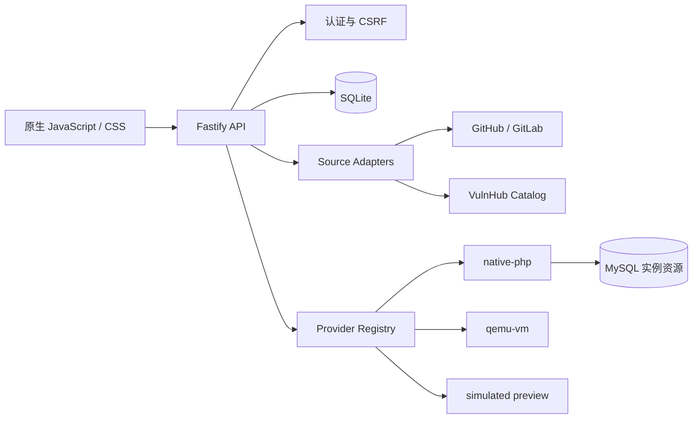

<!-- markdownlint-disable MD013 MD033 MD041 -->

<div align="center">
  
  <h1>VulnLab</h1>
  <p><strong>把分散的开源靶场，收进一个可以真正运行的单机工作台。</strong></p>
  <p>来源导入 · 完整性校验 · 实例生命周期 · 本地运行 · 单服务器部署</p>

  [](https://github.com/Chengxiaoyu1119/CTF-VulnLab/actions/workflows/vulnlab-ci.yml)
  [](https://nodejs.org/)
  [](https://www.typescriptlang.org/)
  [](https://fastify.dev/)
  [](https://sqlite.org/)
  [](LICENSE)
</div>

<p align="center">
  <a href="#项目定位">项目定位</a> ·
  <a href="#快速开始">快速开始</a> ·
  <a href="#核心能力">核心能力</a> ·
  <a href="#技术架构">技术架构</a> ·
  <a href="#验证项目">验证项目</a> ·
  <a href="#单服务器部署">部署</a>
</p>


## 项目定位

VulnLab 是面向个人学习与小团队训练的开源靶场工作台。它不把靶场当作一堆压缩包，而是用统一的来源适配器、运行 Provider 和实例生命周期管理不同项目。

当前版本为 `0.2.0`，可以在 Windows、Linux、macOS 本地运行，也可以部署到单台 Linux 云服务器。主服务使用 Node.js 原生运行，不依赖 Docker。

## 快速开始

### 准备环境

- [Node.js 22 或更高版本](https://nodejs.org/)
- npm（安装 Node.js 时自带）
- 可选：PHP CLI + MySQL，用于运行 DVWA、Pikachu、SQLi-Labs、Upload-Labs
- 可选：QEMU，用于运行已经下载并校验的 VulnHub 虚拟机镜像

### Windows

```powershell
git clone https://github.com/Chengxiaoyu1119/CTF-VulnLab.git
cd CTF-VulnLab
powershell -ExecutionPolicy Bypass -File script/run_vulnlab.ps1
```

### Linux / macOS

```bash
git clone https://github.com/Chengxiaoyu1119/CTF-VulnLab.git
cd CTF-VulnLab
bash script/run_vulnlab.sh
```

启动脚本会在首次运行时按 `package-lock.json` 安装依赖，然后启动开发服务。浏览器打开：

```text
http://127.0.0.1:6710/
```

本地开发账号：

| 角色 | 账号 | 密码 |
| --- | --- | --- |
| 管理员 | `vulnlab-admin` | `VulnLabAdmin123!` |
| 学员 | `vulnlab-learner` | `VulnLabLearner123!` |

> 单服务器部署时必须通过环境变量设置独立密码和 Cookie secret，开发凭据不会在生产模式下启用。

## 核心能力

| 能力 | 当前实现 |
| --- | --- |
| 靶场目录 | 桌面端固定 3×3 工作区，移动端双列布局，保留独立导入与环境页面 |
| 来源导入 | GitHub、GitLab 固定 commit 下载，限制归档体积，校验 SHA-256，生成导入清单 |
| VulnHub | 导入机器目录与元数据，按需下载镜像，校验 MD5、SHA1、SHA-256 |
| 原生 PHP | 为 DVWA、Pikachu、SQLi-Labs、Upload-Labs 创建独立实例目录与运行进程 |
| MySQL 生命周期 | 按实例创建数据库和最小权限账号，结束或过期时回收资源 |
| QEMU 虚拟机 | 支持 OVA、qcow2、raw、vdi、vmdk，使用临时快照和回环端口转发 |
| 状态管理 | SQLite 保存会话、导入任务、下载任务、实例、设置与审计记录 |
| Web 安全 | 签名 HttpOnly Cookie、CSRF 校验、登录限速、请求体限制、生产凭据检查 |
| 运维 | systemd、Caddy、备份、恢复、健康检查和 GitHub Actions 回归 |

### 已收录来源

| 靶场 | 目录/导入 | 当前运行方式 |
| --- | :---: | --- |
| DVWA | ✅ | native-php + MySQL |
| Pikachu | ✅ | native-php + MySQL |
| SQLi-Labs | ✅ | native-php + MySQL |
| Upload-Labs | ✅ | native-php |
| VulnHub Machines | ✅ | qemu-vm |
| Vulhub | ✅ | 目录与来源导入 |
| OWASP Juice Shop | ✅ | 目录与来源导入 |
| OWASP WebGoat | ✅ | 目录与来源导入 |
| OWASP crAPI | ✅ | 目录与来源导入 |

“已经导入”表示来源完成下载、校验、解包和登记；只有匹配到可用 Provider 的项目才会显示为可启动实例。

## 技术架构



- 后端：Node.js 22、TypeScript、Fastify
- 数据：SQLite 单文件数据库
- 前端：原生 JavaScript + CSS，不引入后台组件库
- 运行：Provider 注册机制，HTTP 路由不直接耦合运行命令
- 导入：Source Adapter 注册机制，来源解析与实例运行分离

## 项目结构

```text
CTF-VulnLab/
├─ src/VulnLab/                 Node.js 服务、Web 页面和 Provider
│  ├─ public/                   前端与正式封面素材
│  ├─ importer.ts               GitHub / GitLab 导入与安全解包
│  ├─ providers.ts              运行 Provider 与实例生命周期
│  ├─ vm-download.ts            VulnHub 镜像下载和完整性校验
│  └─ db.ts                     SQLite 数据层
├─ script/                      启动、测试、冒烟和浏览器检查
├─ operations/deploy/vulnlab/   单机部署、备份与恢复
└─ .github/workflows/           持续集成
```

更深入的实现说明见 [Node 应用文档](src/VulnLab/README.md)。

## 验证项目

```powershell
cd src/VulnLab
npm ci
npm run check
npm test
cd ../..
node script/check_vulnlab_node.mjs
```

这组检查会执行 TypeScript 类型检查、构建、导入器测试、虚拟机下载测试、SQLite 生命周期测试、MySQL 资源测试和 Provider 契约测试。

启动服务后，还可以执行：

```powershell
node script/smoke_vulnlab.mjs
python script/browser_check_vulnlab.py
```

浏览器回归会验证桌面 3×3、移动端双列、添加环境入口、独立环境页和控制台错误。

## 单服务器部署

仓库提供不依赖 Docker 的 Linux 原生部署入口，包含 systemd 服务、Caddy 配置、环境变量模板、备份和恢复脚本。

完整步骤见 [原生单机部署指南](operations/deploy/vulnlab/native/README.zh-CN.md)。

## 当前边界与路线

- 当前面向个人学习、本地开发和可信小团队，不是多租户集群调度平台。
- 原生 PHP 进程与 VulnLab 使用同一操作系统账号；需要更强隔离的来源优先接入 QEMU Provider。
- 后续重点是扩大主流必刷靶场的真实运行覆盖、完善 VulnHub 机器适配和增加实例快照管理。

## 许可证

项目自有代码采用 [Apache License 2.0](LICENSE)。`src/VulnLab/public/covers` 中的 Logo 和上游界面截图仍分别遵循对应项目的许可证、版权与品牌要求，来源记录见 [封面素材说明](src/VulnLab/public/covers/README.md)。

安全问题请通过 [GitHub Private Vulnerability Reporting](SECURITY.md) 提交。
