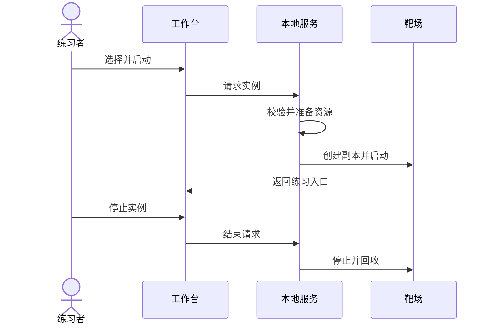

<!-- markdownlint-disable MD013 MD033 MD041 -->

<div align="center">
  
  <h1>VulnLab</h1>
  <p><strong>本地 Web 安全训练工作台</strong></p>
  <p>9 个公开靶场 + 1 个 OA Beta · 一键启动 · 独立实例</p>

  
  
  
  <a href="https://github.com/Chengxiaoyu1119/CTF-VulnLab/actions/workflows/vulnlab-ci.yml"></a>
</div>

<p align="center">
  <a href="#快速开始">快速开始</a> ·
  <a href="#靶场目录">靶场目录</a> ·
  <a href="#文档">文档</a> ·
  <a href="#启动流程">启动流程</a>
</p>

<p align="center">
  
</p>

> 当前面向 Windows x64 本地使用；按需准备运行时和靶场资源，暂未提供独立安装包。

## 快速开始

```powershell
git clone https://github.com/Chengxiaoyu1119/CTF-VulnLab.git
cd CTF-VulnLab
powershell -ExecutionPolicy Bypass -File script/run_vulnlab.ps1
```

打开 `http://127.0.0.1:6710/`，工作台本地默认账号：`vulnlab / vulnlab`。选择靶场并启动；第一次启动会准备所需资源。

## 靶场目录

| 靶场 | 训练方向 | 入口与账号 |
| --- | --- | --- |
| [DVWA](https://github.com/digininja/DVWA) | 常见 Web 漏洞 | 登录：`admin / password` |
| [Pikachu](https://github.com/zhuifengshaonianhanlu/pikachu) | 中文漏洞练习 | 练习账号：`admin / 123456`、`pikachu / 000000`、`test / abc123` |
| [SQLi-Labs](https://github.com/Audi-1/sqli-labs) | SQL 注入 | 首页可直接进入；部分关卡包含登录练习 |
| [Upload-Labs](https://github.com/c0ny1/upload-labs) | 文件上传 | 首页可直接进入 |
| [XVWA](https://github.com/s4n7h0/xvwa) | 综合 Web 漏洞 | 练习账号：`admin / admin`、`xvwa / xvwa`、`user / vulnerable` |
| [OWASP Juice Shop](https://github.com/juice-shop/juice-shop) | 现代 Web 漏洞 | 可直接进入；账户类挑战需自行注册 |
| [OWASP WebGoat](https://github.com/WebGoat/WebGoat) | 课程式安全训练 | 首次使用需创建账号并登录 |
| [OWASP Mutillidae II](https://github.com/webpwnized/mutillidae) | OWASP 漏洞练习 | 可直接进入；登录类练习按页面提示注册 |
| [OWASP PyGoat](https://github.com/adeyosemanputra/pygoat) | Django / OWASP 漏洞 | 需注册账号并登录后进入课程 |
| OA-Vuln-Labs (Beta) | 企业 OA · 25 个漏洞点 · 4 条攻击链 | 初始登录：`admin / ZSD@admin2025!`；无需先找漏洞 |

> OA 账号属于靶场，不是工作台账号；漏洞点和攻击链是登录后的练习内容。OA 资源许可尚未获上游声明；其他靶场个别关卡可能要求注册或登录。

## 核心能力

<table align="center">
  <tr>
    <td align="center"><strong>01 / VERIFIED</strong><br>固定版本 · 完整性校验</td>
    <td align="center"><strong>02 / ON-DEMAND</strong><br>运行时按需准备</td>
    <td align="center"><strong>03 / ISOLATED</strong><br>独立启动 · 续期 · 回收</td>
  </tr>
</table>

## 文档

| 文档 | 内容 |
| --- | --- |
| [开发与运行手册](src/README.md) | 开发、运行时与验证 |
| [设计说明](DESIGN.md) | 界面与响应式规则 |
| [封面素材来源](src/public/covers/README.md) | 靶场图标及来源 |

<details>
  <summary><strong>开发验证</strong></summary>

  ```powershell
  cd src
  npm ci
  npm run check
  npm test
  npm run test:browser
  ```
</details>

## 启动流程


```mermaid
sequenceDiagram
    actor U as 练习者
    participant W as 工作台
    participant S as 本地服务
    participant L as 靶场
    U->>W: 选择并启动
    W->>S: 请求实例
    S->>S: 校验并准备资源
    S->>L: 创建副本并启动
    L-->>W: 返回练习入口
    U->>W: 停止实例
    W->>S: 结束请求
    S->>L: 停止并回收
```

<p align="center"><strong>如果这个项目对你有帮助，欢迎在 GitHub 上点亮一个 Star。</strong></p>
