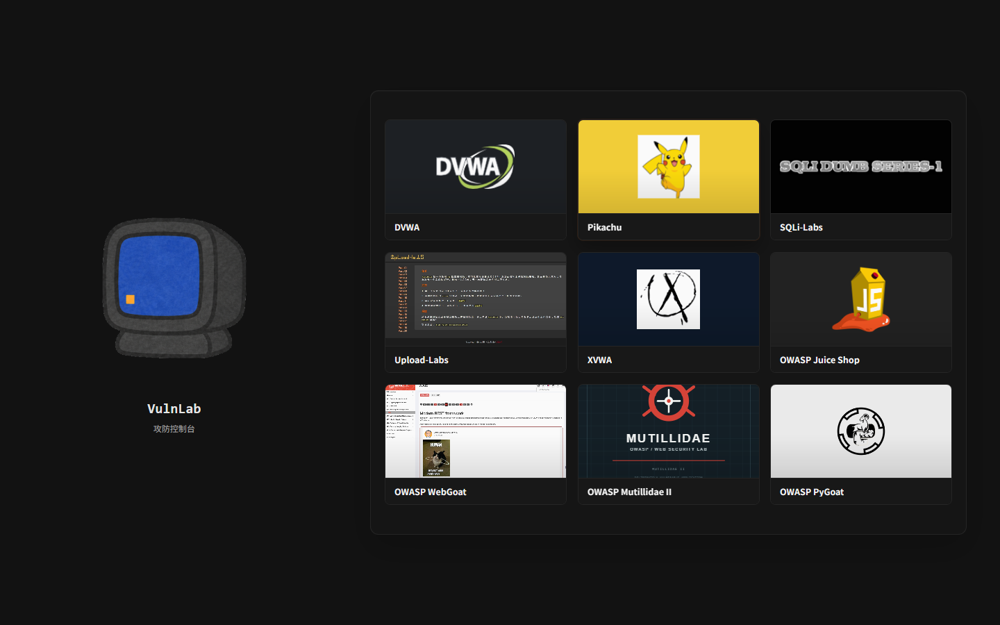

<!-- markdownlint-disable MD013 MD033 MD041 -->

<div align="center">
  
  <h1>VulnLab</h1>
  <p><strong>把主流 Web 安全训练环境装进一台真正可启动的本地工作台。</strong></p>
  <p>固定版本资源 · 一键启动 · 生命周期管理 · 管理数据可追踪</p>

  <a href="https://github.com/Chengxiaoyu1119/CTF-VulnLab/actions/workflows/vulnlab-ci.yml"></a>
  
  
</div>

<p align="center">
  <a href="#快速开始">快速开始</a> ·
  <a href="#核心能力">核心能力</a> ·
  <a href="#内置靶场">内置靶场</a> ·
  <a href="#运行链路">运行链路</a> ·
  <a href="#文档">文档</a>
</p>

<p align="center">
  
</p>

> [!NOTE]
> 当前以 Windows x64 本地运行链路为主。源码启动、按需准备运行时和靶场资源；尚未提供独立安装包。

## 核心能力

<table>
  <tr>
    <td width="33%" valign="top"><strong>固定版本</strong><br>锁定上游来源与版本，下载、解包和目录进入运行区前均执行校验。</td>
    <td width="33%" valign="top"><strong>一键启动</strong><br>按靶场按需准备 Node.js、PHP、MariaDB、Java 或 Python，不要求预先配置整套环境。</td>
    <td width="33%" valign="top"><strong>可回收实例</strong><br>每次练习使用独立运行副本，支持打开、续期、停止与过期回收。</td>
  </tr>
</table>

## 快速开始

```powershell
git clone https://github.com/Chengxiaoyu1119/CTF-VulnLab.git
cd CTF-VulnLab
powershell -ExecutionPolicy Bypass -File script/run_vulnlab.ps1
```

打开 `http://127.0.0.1:6710/`，使用本地默认账号 `vulnlab / vulnlab` 登录，选择靶场后点击“启动环境”。首次启动只准备当前靶场需要的资源。

## 内置靶场

| PHP | PHP / MySQL | Node.js | Java | Python |
| --- | --- | --- | --- | --- |
| Upload-Labs | DVWA · Pikachu · SQLi-Labs · XVWA · Mutillidae II | OWASP Juice Shop | OWASP WebGoat | OWASP PyGoat |

共 `9` 个固定版本训练环境。资源和对应运行时在首次启动时按需准备。

## 运行链路


```mermaid
flowchart LR
    A[选择靶场] --> B[获取固定资源]
    B --> C[校验并准备运行时]
    C --> D[创建独立运行副本]
    D --> E[打开练习入口]
    E --> F[续期或停止并回收]
    classDef accent fill:#ff7f2a,stroke:#ffb400,color:#121212
    classDef surface fill:#1e1e1e,stroke:#668099,color:#f5f5f5
    class A,F accent
    class B,C,D,E surface
```

<details>
  <summary><strong>开发与验证</strong></summary>

  ```powershell
  cd src
  npm ci
  npm run check
  npm test
  npm run test:browser
  ```

  完整运行时、离线 bundle、外部 MySQL 与发布边界见开发运行手册。
</details>

## 文档

| 文档 | 用途 |
| --- | --- |
| [开发与运行手册](src/README.md) | 模块、配置、运行时、Provider 与验证命令 |
| [设计说明](DESIGN.md) | 页面契约、视觉规则与响应式验收 |
| [靶场封面来源](src/public/covers/README.md) | 上游图片、标识与来源链接 |
