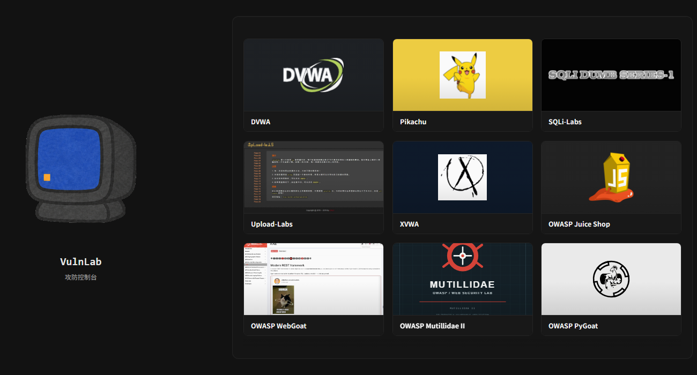
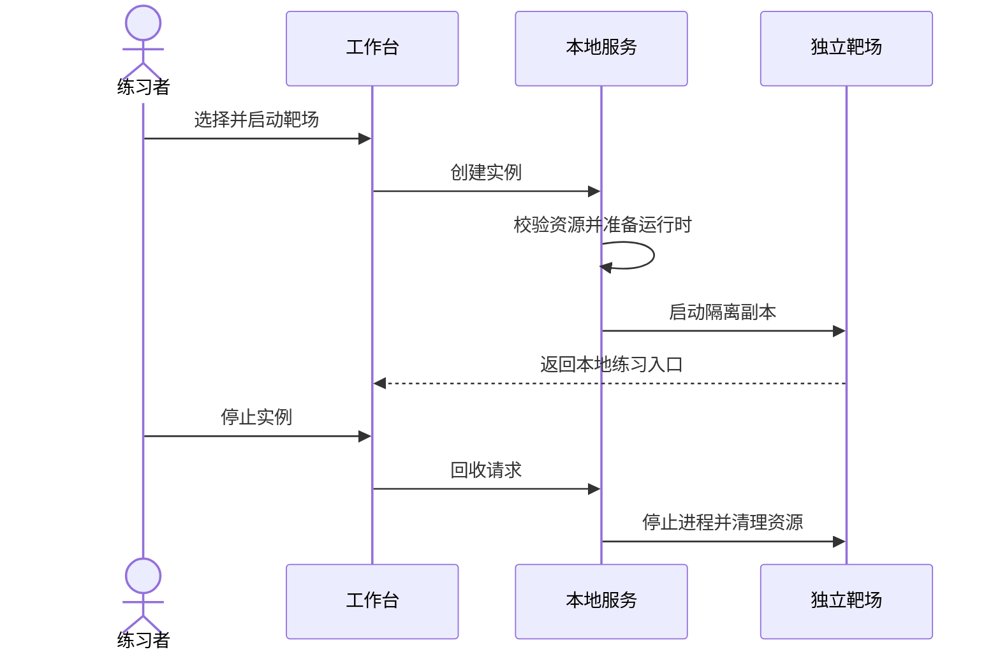

<!-- markdownlint-disable MD013 MD033 MD041 -->

<div align="center">
  
  <h1>攻防控制台</h1>
  <p><strong>网络攻防靶场管理系统</strong></p>
  <p>Windows x64 · 10 个常规靶场 · OA-Vuln-Labs Beta · 独立实例</p>

  
  
  
  <a href="https://github.com/Chengxiaoyu1119/CTF-VulnLab/actions/workflows/vulnlab-ci.yml"></a>
</div>

<p align="center">
  
</p>

## 快速开始

```powershell
git clone https://github.com/Chengxiaoyu1119/CTF-VulnLab.git
cd CTF-VulnLab
powershell -ExecutionPolicy Bypass -File script/run_vulnlab.ps1
```

打开 `http://127.0.0.1:6710/`，使用工作台默认账号 `vulnlab / vulnlab` 登录。选择靶场并启动；首次启动会按需准备运行资源。

## 支持的靶场

| 靶场 | 训练方向 | 进入方式 |
| --- | --- | --- |
| [DVWA](https://github.com/digininja/DVWA) | 常见 Web 漏洞 | `admin / password` |
| [Pikachu](https://github.com/zhuifengshaonianhanlu/pikachu) | 中文漏洞练习 | `admin / 123456`、`pikachu / 000000`、`test / abc123` |
| [XSS-Labs](https://github.com/do0dl3/xss-labs) | XSS 反射与过滤绕过 | 首页直接进入 · 第 17–20 关需要 Flash |
| [SQLi-Labs](https://github.com/Audi-1/sqli-labs) | SQL 注入 | 首页直接进入；部分关卡含登录练习 |
| [Upload-Labs](https://github.com/c0ny1/upload-labs) | 文件上传 | 首页直接进入 |
| [XVWA](https://github.com/s4n7h0/xvwa) | 综合 Web 漏洞 | `admin / admin`、`xvwa / xvwa`、`user / vulnerable` |
| [OWASP Juice Shop](https://github.com/juice-shop/juice-shop) | 现代 Web 安全 | 直接进入；账户挑战需自行注册 |
| [OWASP WebGoat](https://github.com/WebGoat/WebGoat) | 课程式安全训练 | 创建账号并登录 |
| [OWASP Mutillidae II](https://github.com/webpwnized/mutillidae) | OWASP 漏洞练习 | 直接进入；登录练习按页面提示注册 |
| [OWASP PyGoat](https://github.com/adeyosemanputra/pygoat) | Django / OWASP | 注册并登录后进入课程 |
| OA-Vuln-Labs (Beta) | 企业 OA · 25 个漏洞点 · 4 条攻击链 | 初始账号 `admin / ZSD@admin2025!`；登录后练习 |

许可未声明：SQLi-Labs、Upload-Labs、XSS-Labs、OA-Vuln-Labs。

## 启动流程


```mermaid
sequenceDiagram
    actor U as 练习者
    participant W as 工作台
    participant S as 本地服务
    participant L as 独立靶场
    U->>W: 选择并启动靶场
    W->>S: 创建实例
    S->>S: 校验资源并准备运行时
    S->>L: 启动隔离副本
    L-->>W: 返回本地练习入口
    U->>W: 停止实例
    W->>S: 回收请求
    S->>L: 停止进程并清理资源
```

## 文档

| 文档 | 内容 |
| --- | --- |
| [开发与运行手册](src/README.md) | 配置、运行时与验证 |
| [设计说明](DESIGN.md) | 界面与响应式规则 |
| [靶场封面来源](src/public/covers/README.md) | 图片来源与维护 |
| [脚本索引](script/README.md) | 测试、smoke 与工具入口 |

<p align="center"><strong>如果这个项目对你有帮助，欢迎在 GitHub 上点亮一个 Star⭐。</strong></p>
